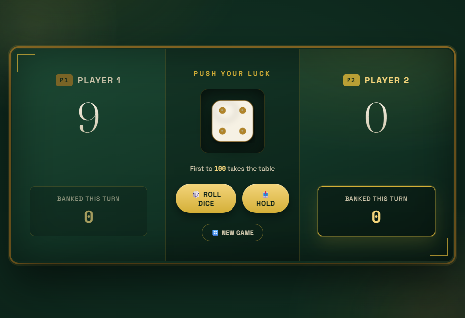
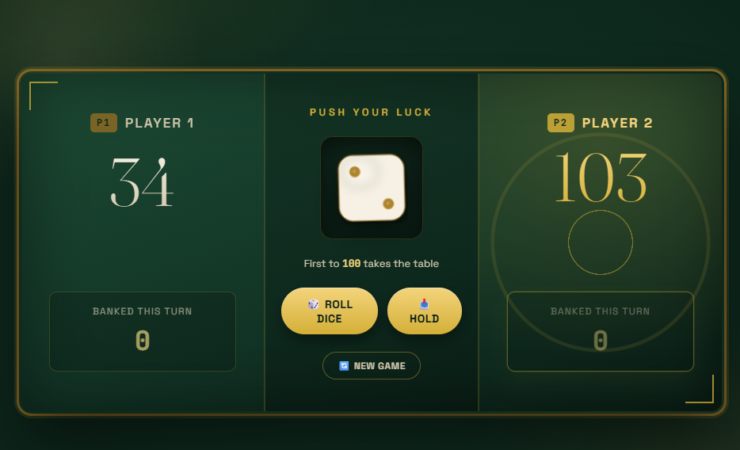

# 🍀 Push Your Luck

A two-player, risk-vs-reward dice game built with HTML, CSS, and JavaScript. Roll to grow your turn score, hold to bank it — but roll a 1 and you lose everything you haven't banked yet. First to 100 or more wins the table.

## 🎮 How to Play

1. **Roll the dice** 🎲 — each roll adds to your current turn score.
2. Roll a **1**, and your current turn score is wiped out, and play passes to the other player.
3. **Hold** 📥 — bank your current turn score into your total and pass the turn.
4. First player to reach **100 points** wins and lights up the table.
5. **New game** 🔄 — resets both scores and starts over.

## 🖼️ Screenshots

**Main display**



**Winner screen**



## ✨ Features

- 🟢 Live turn indicator — the active player's seat glows and pulses
- 🎲 Themed dice faces (gold pips on ivory, matching the felt-table palette)
- 🏆 Winner celebration animation — radiating gold rings and a lifting score
- 📱 Fully responsive layout — collapses to a single column on mobile
- ♿ Respects `prefers-reduced-motion` and includes visible focus states

## 📁 Project Structure

```
push-your-luck/
├── index.html      # markup
├── style.css       # all styling and animations
├── script.js       # game logic
├── dice-1.png ... dice-6.png   # dice face images
└── README.md
```

## 🚀 Getting Started

No build step needed — it's plain static files.

1. Clone or download this repository.
2. Open `index.html` in your browser.

That's it — you're playing.

## 🙌 Credits

Built as a front-end practice project exploring CSS animation, layout, and game-state logic in JavaScript.
